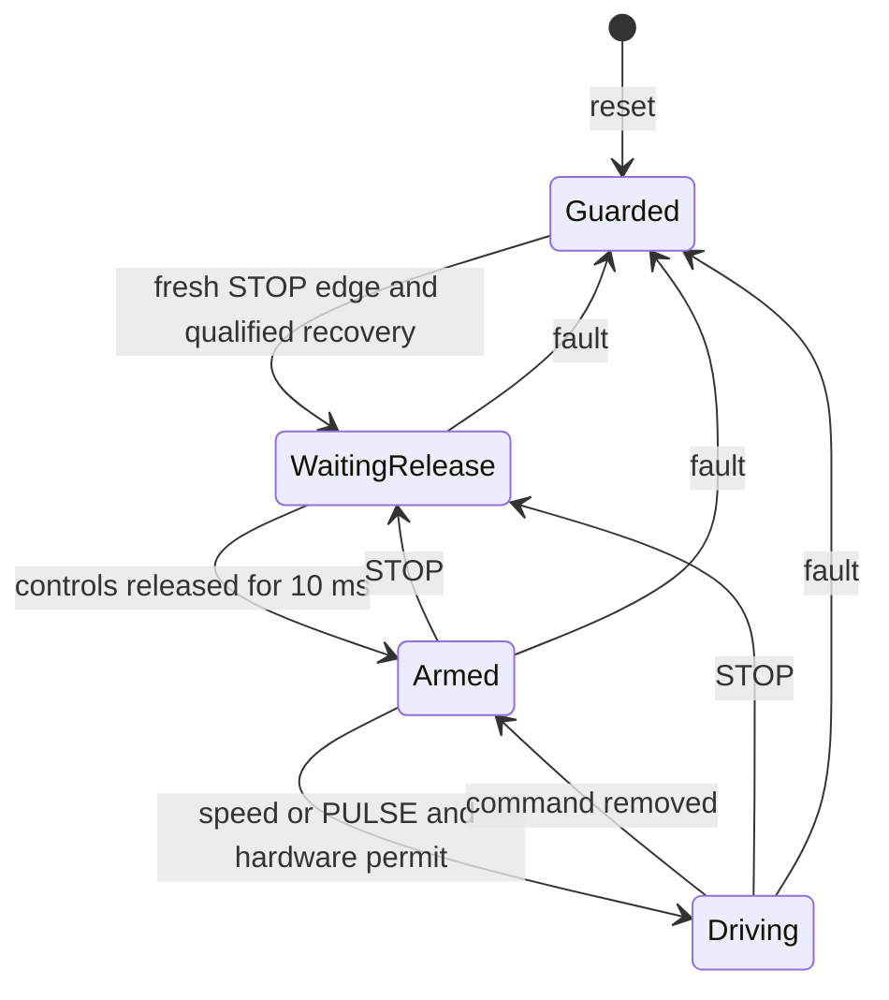

# Worked B8 and B16 controllers: teaching route

This guide belongs to **`feature/b16-solution`**, which stays outside `main`.
The problem presentation and all shared tooling live on `feature/b8-b16-workbench`.
See [branch purposes and update direction](docs/BRANCHES.md). Use the
[New Employee route](NEW-EMPLOYEE-START.md) for a first attempt at the exercise.

Both devices now have worked examples with documented design decisions and unresolved requirements.
The default `platform/firmware/` remains the unfinished starter. Each controller includes only the
public SDK and its own files, and stays outside the learner source handoff bundle.

| Device | Worked source                                                          | Arithmetic and storage                   |
| ------ | ---------------------------------------------------------------------- | ---------------------------------------- |
| B8     | [Byte controller](internal/owner/experiments/b8-controller/README.md)  | Byte pairs, ADC thresholds, compact font |
| B16    | [Word controller](internal/owner/experiments/b16-controller/README.md) | Byte/word arithmetic, binary32, SRAM     |

## 1. Build, run and inspect

Install the [Python and native tools](NEW-EMPLOYEE-START.md#1-install-the-tools), activate `.venv`,
and run these commands from this checkout's root:

```sh
python tools/teaching.py native --root .
python tools/teaching.py test --root .
python tools/teaching.py verify-native --root .
```

The Python runner defaults to B16. Add `--device B8` to select B8 on every command; the build always
selects standard memory, the production watchdog fuse and the matching worked firmware directory.
Native products go to `build/teaching-b16-native/`. Verification writes
`reports/teaching-b16-native.json.gz`, containing the actual image hash, observed device identity,
automated correspondence cases and additional scenarios. A successful automated run still reports
`accepted: false`; it supplies no human approval.

Activate [Emscripten](platform/docs/WASM.md#1-install-and-activate-emscripten), then:

```sh
python tools/teaching.py wasm --root .
python tools/teaching.py check-wasm --root .
python tools/teaching.py verify-wasm --root .
python tools/teaching.py serve --root . --port 8094
```

Wasm products go to `build/teaching-b16-wasm/`. Open the printed loopback URL and use **Selected
firmware**. Component bench executes no firmware. The local upload control accepts the matching
`b8_student.mjs` and `b8_student.wasm` from the same build's `web/` folder; select B16. The page
executes the compiled controller, MCU, plant and renderer in its browser worker.

For B8, use the same route with explicit device selection:

```sh
python tools/teaching.py native --root . --device B8
python tools/teaching.py test --root . --device B8
python tools/teaching.py verify-native --root . --device B8
python tools/teaching.py wasm --root . --device B8
python tools/teaching.py check-wasm --root . --device B8
python tools/teaching.py verify-wasm --root . --device B8
python tools/teaching.py serve --root . --device B8 --port 8095
```

Its products and receipts use `teaching-b8` in place of `teaching-b16`. Choose B8 in the upload UI.
B8 `test` also exercises byte carry/borrow, every generated pixel byte and a native run beyond
the paired-byte epoch wrap. Use separate build directories and ports when comparing controllers.

To start: allow two cool logical seconds, tap STOP, release the controls, then select a speed.
STOP clears the command; its release does not resume the previous speed. After a fault, remove
the cause, allow two seconds of plausible fresh readings at or below 65°C, tap STOP, release all
commands, then select again. Clock failure also requires restoring the clock and MCU RESET.

## 2. Read the implementation in this order

| Code                              | Question to answer                                                  |
| --------------------------------- | ------------------------------------------------------------------- |
| `reset()`                         | How are outputs inhibited before clocks, pins and monitors are set? |
| `timer()` and `step()`            | What belongs in an ISR, and what proves foreground progress?        |
| `contacts()` and `speed()`        | How are mux timing, bounce and conflicting commands distinguished?  |
| ADC section of `step()`           | How are fresh readings, signal plausibility and heat separated?     |
| Recovery section of `step()`      | Why are a new STOP edge and released controls required?             |
| Motion section of `step()`        | Why do startup grace and missing-motion timing have separate ages?  |
| `fault()`, `persist()`, `label()` | How are all causes retained while one prioritized code is shown?    |
| `display()`                       | Who owns the LCD address/selector, and when can a byte be accepted? |
| Final section of `step()`         | Why can one fresh completion authorize at most one monitor renewal? |

The state names below describe combinations of `guard`, `armed` and `running`; the implementation
does not declare a separate state enum.



The physical jar and STOP gate can remove motor drive independently of foreground execution.
Firmware also clears enable, PWM enable and pending duty. Removing drive allows the shaft to
coast and the motor to cool through the plant's physical models; it does not erase motion or heat.

## 3. Timing and ownership decisions

### B8 arithmetic lesson

Compare the implementations of `timer()`, temperature qualification and `display()`. B8 uses
explicit low/high bytes with carry and borrow instead of native word operations. Its timer
snapshot masks the ISR while copying the pair; its ADC/tach reads respect hardware capture order.
The [B8 walkthrough](internal/owner/experiments/b8-controller/README.md) explains the raw ADC
thresholds, 148-byte streamed font and explicit warm-reset diagnosis strategy.

There is no instruction flags register in the C++ binding. Carry/borrow are local helper results;
signed overflow is a separate condition. The helpers are tested against wider host arithmetic,
which remains permitted in tests and physics. These byte representations obey the B8 policy.

### Shared control design

The [candidate design table](internal/owner/experiments/b16-controller/README.md#design-choices-and-timing)
records the complete choices and margins. The central ideas are:

- T0 creates an approximately 1 ms epoch. The ISR acknowledges and increments a word counter;
  it never feeds either supervision monitor.
- Foreground scans all eight mux inputs with the specified 2 microsecond settling interval.
  A stable whole bitmap qualifies after 10 ms. A continuous conflicting speed indication
  qualifies `IF` after 40 ms; a short mechanical changeover is not immediately declared a fault.
- ADC results are consumed once. Plausibility uses the published sensor voltage range with a
  documented guard band. Two plausible hot readings qualify `TH`; signal rails qualify `TS`.
  The controller uses measured values, not the simulator's truth temperature.
- Motion gets 500 ms of grace only on an off-to-on transition, followed by a 100 ms missing-edge
  check. Changing a running speed cannot renew startup grace. Intentional coastdown is not a jam.
- WDT and DMT are enabled and locked. A fresh completion token is consumed after foreground has
  acquired inputs, decided protection and applied outputs. An interrupt that continues to fire
  cannot substitute for that work.
- One foreground owner controls XBUS selection, LCD address and ADC register pairs. LCD writes
  poll BUSY and respect its 8 microsecond recovery; this example does not use DMA or schedule
  every update inside VBLANK. Active-scan writes can tear until the next refresh.

B8 byte operations and B16 word/binary32 operations obey their selected numeric policies.
Host motor, thermal and emulator calculations retain full precision. The model advances at SDK
service boundaries; these deadlines do not establish MCU instruction timing or physical interrupt latency.

## 4. Experiments to try

| Experiment                       | Observe                                                        | Explain                                                        |
| -------------------------------- | -------------------------------------------------------------- | -------------------------------------------------------------- |
| Select 3, hold P, release P      | LCD changes to `3P`, then `3`; motor changes and settles       | Boost overlays a retained speed selection                      |
| Tap STOP while running           | LCD `0`, drive removed, RPM coasts                             | Electrical inhibition and physical motion are different states |
| Lift and reseat the jar          | Immediate drive cutoff, `IL`, deliberate recovery still needed | Reseating is not authorization to restart                      |
| Add frozen fruit or hot veg      | Load, food temperature, current and case/sensor lag change     | One coupled plant supplies all views                           |
| Inject sensor open, then restore | `TS`, persistent inhibit, fresh cool qualification required    | Clearing a fixture does not acknowledge the fault              |
| Jam the shaft                    | Tach stops, `ST` latches and drive is removed                  | A jam is a fault; low RPM alone is not the chosen estimator    |
| Disable foreground execution     | ISR activity may continue; DMT expires and `DM` appears        | Timer interrupts do not prove application progress             |
| Halt the core                    | WDT continues; its reset is recorded as `WD`                   | Independent and core-clock supervision have different clocks   |
| Open LCD BUS (`L`)               | D7–D0 bytes, BUSY/drop counters, VBLANK edges                  | Issued bytes, accepted bytes and visible scanout differ        |

Use **Supervision** (`U`) for monitor state and reboot history; **Thermal + Truth** (`T`) for
measured and physical temperatures; **Motor** (`M`) for rotation and heating. Histories observe
the machine without reading MMIO or feeding monitors. Save the journal to reproduce inputs.
See [workbench controls](platform/docs/ANIMATED-WORKBENCH.md).

## 5. Are the requirements sufficient?

Read the [requirements audit](internal/owner/experiments/b16-controller/REQUIREMENTS-AUDIT.md) after
reviewing the implementation. It maps correspondence to observable behavior and identifies four
decisions: stale ADC versus deadman expiry, deliberate clock-fault recovery, diagnostic lifetime,
and the measurement/validation envelope. These are proposals for customer clarification, not
extra hidden grading rules.

Both candidates pass 61 automated correspondence cases and 19 additional scenarios on native and
actual compiled Wasm. B16 has two characterization probes; B8 has a third for brownout diagnostic
lifetime. Their tests also cover execution past a full 65,536-tick epoch wrap.
The progress-authorization and combined-fault-retention reviews remain open; glyph matching
checks encoding and does not approve human readability. The
[historical receipt](internal/owner/experiments/b16-controller/verification.json) identifies its
original images; rerun verification to identify the image built from this checkout.
The [B8 receipt](internal/owner/experiments/b8-controller/verification.json) records its own images
and standard-memory measurements. Sanitizer instrumentation uses B8 plus; ordinary builds use
standard. Neither object's section accounting measures the runtime stack or physical instruction cost.

As a teaching exercise, choose one unresolved decision, write the proposed customer follow-up,
define an observable test and predicted result, then change the controller. Keep the current
contract tests intact until the contract is revised. Compare native and Wasm results, and record
what the test proves and what still requires review or physical evidence.
