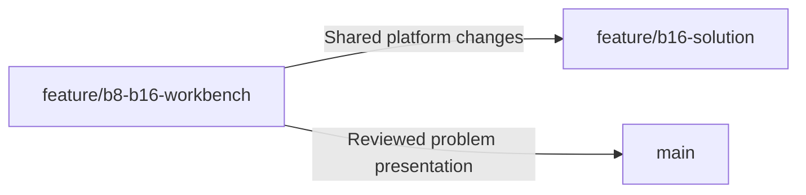

# Problem and teaching branches

The GitHub integration branch is named `main` in this repository. These two working branches
have separate purposes:

| Branch                     | Purpose                         | Integration policy                      |
| -------------------------- | ------------------------------- | --------------------------------------- |
| `feature/b8-b16-workbench` | Problem presentation and tools  | Intended to merge into `main`           |
| `feature/b16-solution`     | Worked B16 example and teaching | Stays separate; never merge into `main` |

## Problem presentation

Start at [New Employee's route](../NEW-EMPLOYEE-START.md). The default firmware remains the
unfinished safe starter. This branch contains both device profiles, Python/PDF tooling,
Emscripten builds, local image upload, JavaScript diagnostics and all C++ visualizations:
motor, thermal/truth, food, contact bounce, supervision/reboot status and LCD bus/VBLANK.

Worked controller firmware, its font oracle, additional solution scenarios, requirements audit,
solution-only tests and teaching guide belong to `feature/b16-solution`. Neither those files nor
their commits are part of the problem branch's ancestry. Maintainer document sources already
under `internal/` retain their existing role outside the New Employee reading route.

## Teaching solution

Switch to `feature/b16-solution` and start with `TEACHING-SOLUTION.md`. That guide explains the
controller's states, timing, register ownership, protection logic and experiments, with commands
for native and Wasm builds. The controller stays in
`internal/owner/experiments/b16-controller/`; selecting it is explicit. The editable starter at
`platform/firmware/` remains available on both branches.

The worked controller is B16-specific. B8 remains a supported exercise target; this branch does
not claim to contain a completed B8 implementation. Automated acceptance, requirements decisions,
human reviews and physical validation remain distinct.

## Direction of changes



Merge shared platform improvements from the problem branch into the solution branch. If an
improvement begins while working on the solution, extract only its shared files or a dedicated
shared-only commit onto the problem branch, verify that branch, then bring it forward into the
solution. Merging the entire solution branch into the problem branch imports its history even
if the solution files are subsequently deleted.

Before switching branches, commit or otherwise preserve local work. Use a separate checkout when
both are active. Keep separate native/Wasm build directories for the starter and worked controller;
CMake caches retain firmware paths and device settings.

## Boundary check

From an activated Python environment at the checkout root:

```sh
python tools/branch_policy.py --root . --expect problem
```

Use `--expect teaching` on the solution branch. CI resolves the role from the source branch and
PR target. PRs targeting `main` or `master` always undergo the problem check, which rejects
solution material and reachable solution history. Full Git history is required; CI checks out
with `fetch-depth: 0`. The workflow provides a failing check; GitHub branch protection must require
that check to make it a mandatory merge gate.

The hosted Site currently demonstrates the worked controller. A Site publication is a separate
compiled snapshot and does not change either branch or the default exercise firmware.
